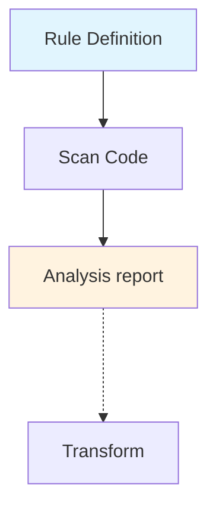
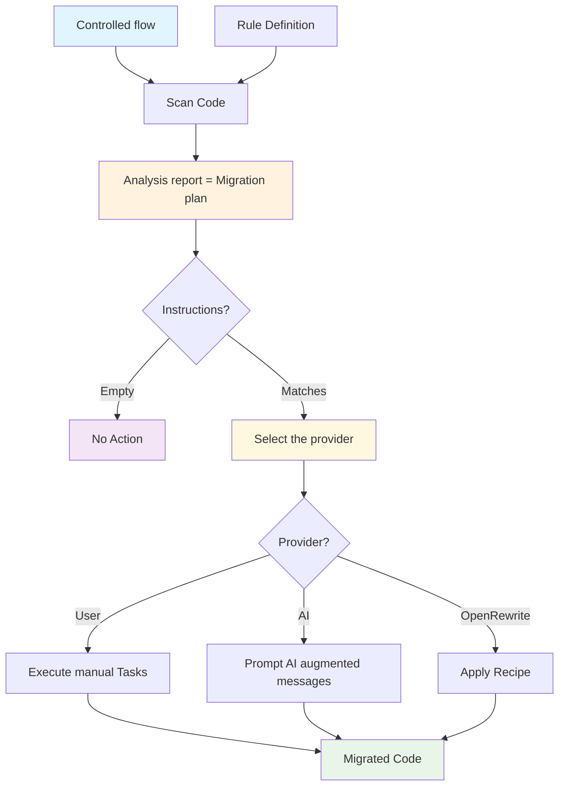

# Migration Tool project

This project demonstrates how we could manage end-to-end the migration process of a Java application from by example Spring Boot to Quarkus using the following concepts:

- A rule definition encapsulating the information about what to search within the code source and the instructions to be executed by a provider: User, AI and Openrewrite to migrate what the rule targets to do
- The report generated by the rules processed by a rule engine and detailing what the engine found, order of execution, metadata, etc 
- A provider (tool, user, AI) able to transform the code using the instructions of the report - aka migration plan

## Migration Flow

**Today**

Many tools, like the [konveyor kantra client](https://github.com/konveyor/kantra/) supports today the following flow. 

**Remark**: The kantra client can nevertheless be used to transform the code using openrewrite recipes.

**Improved**

While the flow, including also the transformation step, works pretty well, it suffers froms 2 limitations: lack of clear instruxtions to be executed during a transformation step like also the order.

This is why we need to support a more robust flow as depicted hereafter:



The rule represents per se the contract definition between what we would like to discover within the code source scanned: java, properties, xml, json, maven or gradle files and what a provider should do to properly transform the code. Ideally we should provide a list of instructions as presented hereafter and tight to the provider able to execute them manually or using a well established technology as [openrewrite](https://docs.openrewrite.org/) or AI, etc ...

```yaml
- category: mandatory
  description: Replace the Spring Boot Application Annotation with QuarkusMain
  labels:
    - konveyor.io/source=springboot
    - konveyor.io/target=quarkus

  message: "Replace the Spring Boot Application Annotation with QuarkusMain"
  ruleID: springboot-annotations-to-quarkus-00000
  
  when:
    java.referenced:
      location: ANNOTATION
      pattern: org.springframework.boot.autoconfigure.SpringBootApplication

  # Order to apply the instructions against the flow
  order: 2
  
  # New section added to help to transform properly the code !
  instructions:
    ai:
      - promptMessage: "Remove the org.springframework.boot.autoconfigure.SpringBootApplication annotation from the main Spring Boot Application class"
    manual:
      - todo: "Remove the org.springframework.boot.autoconfigure.SpringBootApplication annotation from the main Spring Boot Application class"
    openrewrite:
      - name: Migrate Spring Boot to Quarkus
        preconditions:
          - name: org.openrewrite.java.dependencies.search.ModuleHasDependency
            groupIdPattern: org.springframework.boot
            artifactIdPattern: spring-boot
            version: '[3.5,)'
        recipeList:
          - dev.snowdrop.openrewrite.recipe.spring.ReplaceSpringBootApplicationAnnotationWithQuarkusMain
          - dev.snowdrop.openrewrite.recipe.spring.AddQuarkusRun
        gav:
          - dev.snowdrop:openrewrite-recipes:1.0.0-SNAPSHOT
```

The project uses the [Spring TODO](./applications/spring-boot-todo-app) example as the project to be analyzed using augmented [rules](./cookbook/rules).

The poc has been designed using the following technology:
- [Quarkus and Picocli](https://quarkus.io/guides/picocli) to manage the CLI part 
- [konveyor jdt language server](https://github.com/konveyor/java-analyzer-bundle) to scan the java files to find using a rule definition: an annotation, import, method, etc
- [Openrewrite recipe](https://docs.openrewrite.org/concepts-and-explanations/recipes) to execute using the `maven rewrite` goal the transformation as defined part of the rule's instructions
- The launch of the jdt-ls server like the maven openrewrite's goal command are executed as OS processes using Java `ProcessBuilder`.

**Remark**: The rule engine of this PoC is pretty basic and only translate the YAML `java.referenced` value to the corresponding `json request` needed to execute the JSON-RPC call with the command [io.konveyor.tackle.RuleEntry](https://github.com/konveyor/java-analyzer-bundle/blob/b387834212adb6271a233efe310e6c3e0b113029/java-analyzer-bundle.core/src/main/java/io/konveyor/tackle/core/internal/SampleDelegateCommandHandler.java#L47-L53).

## Requirements

- Java 21 installed and Maven 3.9

## Setup

First, compile the project

```shell
./mvnw clean install
```

## Konveyor jdt-ls

Download the [konveyor language server](https://github.com/konveyor/java-analyzer-bundle) using the following image:
```shell
set VERSION latest

set ID $(podman create --name kantra-download quay.io/konveyor/kantra:$VERSION)
podman cp $ID:/jdtls ./jdt/konveyor-jdtls
```

**optional**: Copy the `konveyor-jdtls/java-analyzer-bundle/java-analyzer-bundle.core/target/java-analyzer-bundle.core-1.0.0-SNAPSHOT.jarjava-analyzer-bundle.core-1.0.0-SNAPSHOT.jar` to the `./lib/` folder of this project to use it as dependency (to access the code) as it is not published on a maven repository server !

## Scan and analyze

To execute the command using the Quarkus Picocli CLI able to scan, analyze and generate the migration plan report (optional), execute this command 
```shell
Usage: java-analyzer analyze [-v] [--jdt-ls-path=<jdtLsPath>]
                             [--jdt-workspace=<jdtWorkspace>] [-r=<rulesPath>]
                             <appPath>
Analyze a project for migration
      <appPath>             Path to the Java project to analyze
      --jdt-ls-path=<jdtLsPath>
                            Path to JDT-LS installation (default: from config)
      --jdt-workspace=<jdtWorkspace>
                            Path to JDT workspace directory (default: from
                              config)
  -r, --rules=<rulesPath>   Path to rules directory (default: from config)
  -v, --verbose             Enable verbose output
  
...  

mvn -pl migration-tool quarkus:dev -Dquarkus.args="analyze --jdt-ls-path /PATH/TO/java-analyzer-quarkus/jdt/konveyor-jdtls --jdt-workspace /PATH/TO/java-analyzer-quarkus/jdt -r /PATH/TO/java-analyzer-quarkus/rules ./applications/spring-boot-todo-app"
```

To avoid to pass the parameters to the command, you can use the "defaults" [application.properties](src/main/resources/application.properties) and just pass the path of the application to be analyzed

```shell
mvn -pl migration-tool quarkus:dev -Dquarkus.args="analyze ../applications/spring-boot-todo-app"
```

You can check the log of the language server from this folder: `jdt/.jdt_workspace/.metadata/.log` !

During the execution of the command, you will be able to see within the terminal the log reporting the JSON responses like also a summary table
```text
2025-09-29 12:52:43,605 INFO  [dev.sno.ana.ser.LsSearchService] (ForkJoinPool.commonPool-worker-5) ==== CLIENT: --- Search Results found for rule: springboot-import-to-quarkus-00000.
2025-09-29 12:52:43,606 INFO  [dev.sno.ana.ser.LsSearchService] (ForkJoinPool.commonPool-worker-5) ==== CLIENT: --- JSON response: [
  {
    "name": "org.springframework.boot.autoconfigure.SpringBootApplication",
    "kind": 2.0,
    "location": {
      "uri": "file:///Users/cmoullia/code/application-modernisation/migration-tool-parent/applications/spring-boot-todo-app/src/main/java/com/todo/app/AppApplication.java",
      "range": {
        "start": {
          "line": 3.0,
          "character": 7.0
        },
        "end": {
          "line": 3.0,
          "character": 67.0
        }
      }
    },
    "containerName": ""
  }
]
...

=== Code Analysis Results ===
┌─────────────────────────────────────────────┬─────┬──────────────────────────────────────────────────────────────────────────────────────────────────────────────────────────────────┐
│                   Rule ID                   │Found│                                                       Information Details                                                        │
├─────────────────────────────────────────────┼─────┼──────────────────────────────────────────────────────────────────────────────────────────────────────────────────────────────────┤
│springboot-annotations-notfound-00000        │ No  │No symbols found                                                                                                                  │
├─────────────────────────────────────────────┼─────┼──────────────────────────────────────────────────────────────────────────────────────────────────────────────────────────────────┤
│springboot-annotations-to-quarkus-00000      │ Yes │Found SpringBootApplication at line 6, char: 1 - 22                                                                               │
│                                             │     │file:///Users/cmoullia/code/application-modernisation/migration-tool-parent/applications/spring-boot-todo-app/src/main/java/com/to│
│                                             │     │do/app/AppApplication.java                                                                                                        │
├─────────────────────────────────────────────┼─────┼──────────────────────────────────────────────────────────────────────────────────────────────────────────────────────────────────┤
│springboot-import-to-quarkus-00000           │ Yes │Found org.springframework.boot.autoconfigure.SpringBootApplication at line 4, char: 7 - 67                                        │
│                                             │     │file:///Users/cmoullia/code/application-modernisation/migration-tool-parent/applications/spring-boot-todo-app/src/main/java/com/to│
│                                             │     │do/app/AppApplication.java                                                                                                        │
└─────────────────────────────────────────────┴─────┴──────────────────────────────────────────────────────────────────────────────────────────────────────────────────────────────────┘


```

If you want to populate an analysis report (kind of migration plan) then pass the parameter `-o json` top the command. A json file having as
name: `analysing-report_yyyy-mm-dd_hh:mm.json` will be generated within the project scanned

```shell
mvn -pl migration-tool quarkus:dev -Dquarkus.args="analyze ../applications/spring-boot-todo-app -o json"
```

## Transform your application

Now that we have a migration plan (aka list of instructions to be executed by a provider like openrewrite, user or AI), we can perform the transformation using the command `transform` where we pass as parameter the provider to be used.

**Remark**: The default provider is `openwrite` but you can use too: `manual` or `ai`

### Openrewrite

To use openrewrite, execute the following command with or without the `dryRun` mode. If you use the `--dry-run` parameter, then openrewrite will generate `rewrite.patch` file(s) under the folder: `target/rewrite` of the analyzed project instead of changing the code directly !

```shell
mvn -pl migration-tool quarkus:dev -Dquarkus.args="transform ../applications/spring-boot-todo-app -p openrewrite --dry-run"
```

Log of the command executed 
```text
2025-09-29 13:03:20,735 INFO  [dev.sno.com.TransformCommand] (Quarkus Main Thread) ✅ Starting transformation for project at: /Users/cmoullia/code/application-modernisation/migration-tool-parent/applications/spring-boot-todo-app
2025-09-29 13:03:20,739 INFO  [dev.sno.com.TransformCommand] (Quarkus Main Thread) 📄 Loading migration tasks from: analysing-report_2025-09-26_14:05.json
2025-09-29 13:03:20,879 INFO  [dev.sno.com.TransformCommand] (Quarkus Main Thread) 📋 Found 3 migration tasks to process
2025-09-29 13:03:20,880 INFO  [dev.sno.com.TransformCommand] (Quarkus Main Thread) 🔄 Processing migration task: springboot-annotations-notfound-00000
2025-09-29 13:03:20,881 WARN  [dev.sno.com.TransformCommand] (Quarkus Main Thread)    ⚠️  No OpenRewrite instructions found for task, skipping
2025-09-29 13:03:20,882 INFO  [dev.sno.com.TransformCommand] (Quarkus Main Thread) 🔄 Processing migration task: springboot-annotations-to-quarkus-00000
2025-09-29 13:03:28,091 INFO  [dev.sno.com.TransformCommand] (Quarkus Main Thread)    ✅ OpenRewrite execution completed successfully
2025-09-29 13:03:28,092 INFO  [dev.sno.com.TransformCommand] (Quarkus Main Thread) 🔄 Processing migration task: springboot-import-to-quarkus-00000
2025-09-29 13:03:28,093 WARN  [dev.sno.com.TransformCommand] (Quarkus Main Thread)    ⚠️  No OpenRewrite instructions found for task, skipping
2025-09-29 13:03:28,094 INFO  [dev.sno.com.TransformCommand] (Quarkus Main Thread) ----------------------------------------
2025-09-29 13:03:28,095 INFO  [dev.sno.com.TransformCommand] (Quarkus Main Thread) --- Elapsed time: 7359 ms ---
2025-09-29 13:03:28,096 INFO  [dev.sno.com.TransformCommand] (Quarkus Main Thread) ----------------------------------------
```

### AI

**Important**: Until now, this Quarkus client only supports to use Anthropic and Claude Sonnet 4 model

To be able to perform the transformation of the code, using AI, it is needed to set part of the `.env` file some new properties:
```properties
QUARKUS_LANGCHAIN4J_ANTHROPIC_CHAT_MODEL_MODEL_NAME=premium
QUARKUS_LANGCHAIN4J_ANTHROPIC_BASE_URL=<THE_ANTHROPIC_API_SERVER>
QUARKUS_LANGCHAIN4J_ANTHROPIC_API_KEY=<YOUR_ANTHROPIC_API_KEY>
QUARKUS_LANGCHAIN4J_ANTHROPIC_TIMEOUT=60
MIGRATION_TOOL=/PATH/TO/migration-tool/target/quarkus-app/quarkus-run.jar
```
Source the `.env` file and don't forget to generate the `analyze/migration plan` report before to perform the transformation
```shell
mvn -pl migration-tool quarkus:dev -Dquarkus.args="analyze ../applications/demo-spring-boot-todo-app -o json"
```

As it is needed to interact with AI, then we cannot use the command `mvn quarkus:dev` but instead the uber jar file.
Execute the following command within a Spring Boot project to be analyzed and migrated

```shell
pushd applications/demo-spring-boot-todo-app

export ANALYZER_APP_PATH=/PATH/TO/demo-spring-boot-todo-app
java -jar $MIGRATION_TOOL transform . -p ai
popd
```
Check the console to see the tasks executed and AI's reponses:
```shell
2025-10-08 13:28:56,037 INFO  [dev.sno.com.TransformCommand] (main) 🔄 Processing migration task: springboot-replace-bom-quarkus-0000
2025-10-08 13:28:56,039 INFO  [dev.sno.tra.pro.imp.AiProvider] (main) Task: Add to the pom.xml file the Quarkus BOM dependency within the dependencyManagement section and the following dependencies: quarkus-arc, quarkus-core
2025-10-08 13:28:56,039 INFO  [dev.sno.tra.pro.imp.AiProvider] (main) Task: The version of quarkus to be used and to included within the pom.xml properties is 3.26.4.
2025-10-08 13:28:56,039 INFO  [dev.sno.tra.pro.imp.AiProvider] (main) Hello! I'm your AI migration assistant.
2025-10-08 13:28:58,981 INFO  [dev.sno.tra.pro.ai.FileSystemTool] (main) Reading file: pom.xml
2025-10-08 13:29:15,541 INFO  [dev.sno.tra.pro.imp.AiProvider] (main) ============= Claude response: Successfully added the Quarkus BOM dependency to the dependencyManagement section and included the quarkus-arc and quarkus-core dependencies. The Quarkus version property has also been added for version management.
2025-10-08 13:29:18,549 INFO  [dev.sno.tra.pro.ai.FileSystemTool] (main) Reading file: pom.xml
2025-10-08 13:29:33,810 INFO  [dev.sno.tra.pro.imp.AiProvider] (main) ============= Claude response: Successfully updated the Quarkus version to 3.26.4 in the properties section of the pom.xml file.
2025-10-08 13:29:33,811 INFO  [dev.sno.tra.TransformationService] (main) ✅ Task completed successfully:    ✅ ai execution completed successfully
...
```
If the AI responses are not accurate, then you will have to adapt the instructions as described part of the different Rules YAML files available here: `cookbook/rules/ddd-springboot-****.yaml` !

## Tips

The `analyze` or `transform` commands can be executed using the quarkus uber jar file. Create in this case, an `.env` file, to configure properly the different properties needed:

```properties
# .env file content
ANALYZER_JDT_LS_PATH=jdt/konveyor-jdtls
ANALYZER_JDT_WORKSPACE_PATH=jdt
ANALYZER_RULES_PATH=cookbook/rules
```
Next source it and execute the following java commands:

```shell
java -jar migration-tool/target/quarkus-app/quarkus-run.jar analyze $(pwd)/applications/spring-boot-todo-app
java -jar migration-tool/target/quarkus-app/quarkus-run.jar transform $(pwd)/applications/spring-boot-todo-app -p openrewrite --dry-run
```

If you want to test separately the openrewrite recipes, then use the [openrewrite maven plugin command](https://docs.openrewrite.org/reference/rewrite-maven-plugin) top of a spring boot project. Take care that your project is under git control as code will be transformed !

```shell
cd applications/spring-boot-todo-app
mvn -U org.openrewrite.maven:rewrite-maven-plugin:run \
   -Drewrite.recipeArtifactCoordinates=dev.snowdrop:java-analyzer-quarkus:1.0.0-SNAPSHOT \
   -Dorg.openrewrite.quarkus.spring.ReplaceSpringBootApplicationAnnotationWithQuarkusMain
```

Instead of changing the code, you can use the dryrun goal to get a patch
```shell
cd applications/spring-boot-todo-app
mvn -U org.openrewrite.maven:rewrite-maven-plugin:dryRun \
   -Drewrite.recipeArtifactCoordinates=dev.snowdrop:openrewrite-recipes:1.0.0-SNAPSHOT \
   -Drewrite.activeRecipes=dev.snowdrop.openrewrite.recipe.spring.ReplaceSpringBootApplicationWithQuarkusMainAnnotation  
```
When done, open the diff patch generated: `/PATH/TO/spring-boot-todo-app/target/rewrite/rewrite.patch`

To execute several recipes aggregated in a yaml file placed at the root of the project, execute this command:
```shell
mvn -U org.openrewrite.maven:rewrite-maven-plugin:dryRun \
  -Drewrite.activeRecipes=dev.snowdrop.text.SearchText,dev.snowdrop.java.StandardJavaConventions,dev.snowdrop.java.spring.SearchSpringBootAnnotation \
  -Drewrite.recipeArtifactCoordinates=org.openrewrite:rewrite-java:8.62.4,org.openrewrite.recipe:rewrite-java-dependencies:1.42.0,dev.snowdrop:openrewrite-recipes:1.0.0-SNAPSHOT \
  -Drewrite.exportDatatables=true \
  -Drewrite.configLocation=my-rewrite-1.yml
...
[WARNING] These recipes would make changes to applications/spring-boot-todo-app/my-rewrite.yml:
[WARNING]     dev.snowdrop.text.SearchText
[WARNING]         org.openrewrite.text.Find: {find=public class TaskController}
[WARNING] Patch file available:
[WARNING]     /Users/cmoullia/code/application-modernisation/migration-tool-parent/applications/spring-boot-todo-app/target/rewrite/rewrite.patch
[WARNING] Estimate time saved: 40m
[WARNING] Run 'mvn rewrite:run' to apply the recipes.  
```

Command using another YAML example
```shell
mvn -U org.openrewrite.maven:rewrite-maven-plugin:dryRun \
  -Drewrite.activeRecipes=dev.snowdrop.java.spring.SearchSpringBootAnnotation \
  -Drewrite.recipeArtifactCoordinates=org.openrewrite:rewrite-java:8.62.4,org.openrewrite.recipe:rewrite-java-dependencies:1.42.0,dev.snowdrop:openrewrite-recipes:1.0.0-SNAPSHOT \
  -Drewrite.exportDatatables=true \
  -Drewrite.configLocation=my-rewrite-2.yml
```

## TODO

| Task   | Status | Description                                                                                                                                                                                                                                                                                                                                                                                                                                                                                                                                                                                                                                                                                                                                                                                                         | Comment |
|--------|--------|---------------------------------------------------------------------------------------------------------------------------------------------------------------------------------------------------------------------------------------------------------------------------------------------------------------------------------------------------------------------------------------------------------------------------------------------------------------------------------------------------------------------------------------------------------------------------------------------------------------------------------------------------------------------------------------------------------------------------------------------------------------------------------------------------------------------|---------|
| MT-001 |        | Check what [spring-migrator-tool](https://github.com/spring-projects-experimental/spring-boot-migrator/blob/main/components/sbm-support-boot/src/main/resources/recipes/initialize-spring-boot-migration.yaml) did to reuse some ideas to configure the instructions using `Actions` able to configure the recipe. The [action](https://github.com/spring-projects-experimental/spring-boot-migrator/blob/main/components/sbm-core/src/main/java/org/springframework/sbm/build/migration/actions/AddMavenDependencyManagementAction.java)'s definition is used as input to apply the corresponding openrewrite's [recipe](https://github.com/spring-projects-experimental/spring-boot-migrator/blob/main/components/sbm-core/src/main/java/org/springframework/sbm/build/impl/OpenRewriteMavenBuildFile.java#L376). |         |
| MT-002 |        | Investigate if the language server could be replaced using Openrewrite concepts such as: [searchResult](https://docs.openrewrite.org/concepts-and-explanations/markers#searchresult)'s marker, [DataTable](https://docs.openrewrite.org/authoring-recipes/data-tables#writing-a-recipe-that-produces-a-data-table) or [Scanning recipe](https://docs.openrewrite.org/concepts-and-explanations/recipes#scanning-recipes)                                                                                                                                                                                                                                                                                                                                                                                            |         |
| MT-003 |        | Discuss and define the level of granularity between what the rule targets to do and the steps/actions that the provider will support. Such a granularity can start with a `1` to `1` relation to a `1` to `many` but where the `many` is executed as a composite component or pipeline: https://docs.openrewrite.org/concepts-and-explanations/recipes#recipe-execution-pipeline, https://docs.openrewrite.org/concepts-and-explanations/recipes#scanning-recipes                                                                                                                                                                                                                                                                                                                                                   |         |
| MT-004 |        | What about creating a migration plan like this one: https://docs.openrewrite.org/recipes/java/migrate/search/planjavamigration ?                                                                                                                                                                                                                                                                                                                                                                                                                                                                                                                                                                                                                                                                                    |         |
| MT-005 |        | Do we have to integrate a workflow engine part of the solution to externalize the sequential approach of the openrewrite framework within a separate engine ?                                                                                                                                                                                                                                                                                                                                                                                                                                                                                                                                                                                                                                                       |         |


## Deprecated

### Start using the JdtlsFactory Main application

Before to run the server and client, configure the following system properties or override the Quarkus properties[application.properties](src/main/resources/application.properties):
- `JDT_WKS`: Path of the folder containing the jdt-ls workspace, .metadata and log. Default: `./jdt/`
- `JDT_LS_PATH`: Path of the jdt language server folder. Default: `./jdt/konveyor-jdtls`
- `LS_CMD`: Language server command to be executed. Default: `io.konveyor.tackle.ruleEntry`, etc
- `APP_PATH`: Path of the java project to analyze. Default: `./applications/spring-boot-todo-app`
- `RULES_PATH`: Path of the rules. Default: `./rules`

```shell
mvn exec:java
```

### Trick to path the eclipse osgi server

Here is the trick to do to add a bundle to the OSGI jdt-ls server. This step is optional as we will pass the bundle path as initialization parameter to the language server !

Edit the `config.ini` file corresponding to your architecture: mac, linux, mac_arm under the folder konveyor-jdtls/config_<ARCH>

Modify within the config.ini file the `osgi.bundles` property and include after the `org.apache.commons.lang3...` jar the BundleSymbolicName of: java-analyzer-bundle.core-1.0.0-SNAPSHOT.jar
```text
osgi.bundles=...org.apache.commons.lang3_3.14.0.jar@4,reference\:file\:java-analyzer-bundle.core-1.0.0-SNAPSHOT.jar@2,...
```

Copy the java-analyzer-bundle.core-1.0.0-SNAPSHOT.jar file from the path `konveyor-jdtls/java-analyzer-bundle/java-analyzer-bundle.core/target/` to the `plugins` folder

### Download jdt-ls

Alternatively, you can also download the [Eclipse JDT Language Server](https://github.com/eclipse-jdtls/eclipse.jdt.ls):

```shell
wget https://www.eclipse.org/downloads/download.php?file=/jdtls/milestones/1.50.0/jdt-language-server-1.50.0-202509041425.tar.gz > jdt-language-server-1.50.0.tar.gz
mkdir jdt-ls
tar -vxf jdt-language-server-1.50.0.tar.gz -C jdt-ls
```

