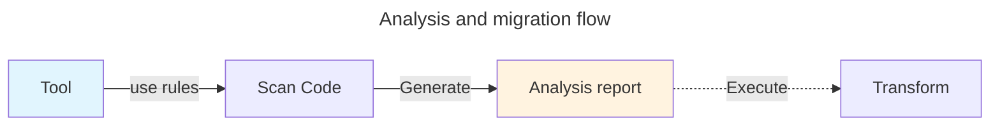
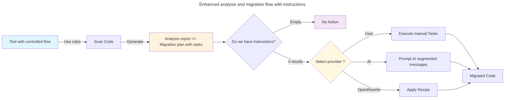

[](https://github.com/snowdrop/migration-tool/actions/workflows/mvn-build.yml)
[](https://www.apache.org/licenses/LICENSE-2.0)

# Migration Tool project

This project and proof of concept show how to better handle the end-to-end migration of a Java application — for example, from Spring Boot to Quarkus — using new concepts that organize the process into ordered instructions managed by different providers. We’ve focused especially on making it easier for users to debug and test the transformation, particularly the matching conditions and resulting output.
## Dictionary

- **Rule**: A rule defines the information about what the tool will search within the code source of the project scanned like the instructions to be executed by a provider
- **Provider**: A provider is a system able to execute the instructions defined part of a rule where the condition(s) matched. Different providers could be implemented such as: [Openrewrite recipe](https://docs.openrewrite.org/recipes), AI or user
- **Analysis report**: The analysis report generated by a rule engine contains issues where each issue will tell to the tool or user what they should do, when it should be used and for which purpose.
- **Migration plan**: A migration plan is an enhanced analysis report where the issue have been augmented with instructions that different providers could apply during the transformation step.

## Migration Flow

### Introduction

Many tools, like the [konveyor kantra client](https://github.com/konveyor/kantra/) supports today the following flow. It generates an analysis report that users can use to review the issues reported, their criticality and what they should do to transform the code part of the message and/or links. 

> [!NOTE]
> The kantra client can be used to transform the code using openrewrite recipes.

While this flow, which also includes instructions to be executed manually or by an external tool; IDE, etc., works pretty well, it suffers from a few limitations: 

- Lack of clear instructions to be executed during a transformation step according to the target technology to be used: openrewrite, AI, etc. 
- No order to play or execute the instructions,
- The absence of `precondition` prevents determining the application's `eligibility` for analysis,
- Difficulty to figure out which rules should be used part of a migration plan,
- Complexity of the rule syntax to define the `match` condition with operators: `AND`, `OR` to indentify files where changes are needed

While such limitations are not problematic for the users doing manually the transformation or executing a predefined migration plan, that could become a real challenge when it is needed to apply recipes or delegate to AI the responsibility to propose solutions. 

AI will certainly generate hallucinating results and this lack of predictability will discourage many users to rely on it. 

On the other site, if you use as technology `openrewrite` or equivalent, the execution of the transformation steps could fail when by example maven compiles the code of the project analyzed due to changes applied to remove dependencies in a wrong order !

This is why it is important that we improve the existing flow to propose a more `controlled` or `enhanced` flow as depicted hereafter:



### Enhanced rule

The rule represents, per se, the contract definition between what we would like to discover within the code source scanned: java, properties, xml, json, maven or gradle files and what a provider should do to properly transform the code. 

As presented hereafter, we have introduced different new fields part of the Rule YAML file:

- `order`: The order to apply the instructions against the flow which is composed of several rules
- `instructions`: List of instructions/tasks to be executed by a provider

```yaml
- ruleID: springboot-annotations-to-quarkus-00000
  category: mandatory
  description: Replace the Spring Boot Application Annotation with QuarkusMain
  labels:
    - konveyor.io/source=springboot
    - konveyor.io/target=quarkus

  message: "Replace the Spring Boot Application Annotation with QuarkusMain"
  
  when:
    java.referenced:
      location: ANNOTATION
      pattern: org.springframework.boot.autoconfigure.SpringBootApplication

  # Order to apply the instructions against the flow
  order: 2
  
  # New section added to help to transform properly the code !
  instructions:
    ai:
      - tasks:
        - "Remove the org.springframework.boot.autoconfigure.SpringBootApplication annotation from the main Spring Boot Application class"
    manual:
      - todo: "Remove the org.springframework.boot.autoconfigure.SpringBootApplication annotation from the main Spring Boot Application class"
    openrewrite:
      - name: Migrate Spring Boot to Quarkus
        preconditions:
          - name: org.openrewrite.java.dependencies.search.ModuleHasDependency
            groupIdPattern: org.springframework.boot
            artifactIdPattern: spring-boot
            version: '[3.5,)'
        recipeList:
          - dev.snowdrop.mtool.openrewrite.recipe.ReplaceSpringBootApplicationAnnotationWithQuarkusMain
          - spring.recipe.dev.snowdrop.mtool.openrewrite.AddQuarkusRun
        gav:
          - dev.snowdrop:openrewrite-recipes:1.0.0-SNAPSHOT
```
The list of the AI's tasks will be executed one by one as user's chat message. When code is generated, the user will be able to accept or reject the proposition.

The openrewrite section contains the list of the recipes and/or preconditions to be executed using the maven openrewrite goal and gav are maven dependencies

To make an application `elligible` for a migration plan and by consequence to let the `conditions` of the rules to be then executed, we have introduced
a new field for that purpose: `precondition`. If, during the `analysis` of the application, the `precondition` fails, then the process stops otherwise the conditions will be executed:

```yaml
- category: mandatory
  customVariables: []
  description: SpringBoot to Quarkus
  effort: 1
  labels:
    - konveyor.io/source=springboot
    - konveyor.io/target=quarkus
  links: []
  message: "SpringBoot to Quarkus."
  ruleID: spring-boot-parent-precondition-match
  when:
    # Example of precondition checking if we have a Spring Boot Parent version: 3.5.3
    precondition: |
      pom.dependency is (gavs='org.springframework.boot:spring-boot-starter-parent:3.5.3')
    # If the precondition matches and is tru, then the condition's rule will be executed
    condition: |
      java.annotation is '@SpringBootApplication'
...
```
To simplify the adoption of the Rule as unit of work to analyse an application to be migrated, we have simplified the YAML query syntax to adopt a more user-friendly language more in line with the language that a user will use to search about something in a project. 

The simplified query language syntax is defined using Antlr grammar and supports a query with a simple `clause` or multiple `clauses` separated with `AND`, `OR` operators

```g4
grammar Query;

@header {
package dev.snowdrop.parser.antlr;
}

searchQuery: operation;
operation
    : operation AND operation #AndOperation
    | operation OR operation  #OrOperation
    | clause                  #SimpleClause
    ;

clause: fileType ('.' symbol)? ('is' | '=') (value | '(' keyValuePair (',' keyValuePair)* ')');
fileType: 'JAVA' | 'java' | 'POM' | 'pom' | 'TEXT' | 'text' | 'PROPERTY' | 'property' | 'YAML' | 'yaml' | 'JSON' | 'json';
symbol: ID;
keyValuePair: key '=' value;
key: QUOTED_STRING | ID;
value: QUOTED_STRING | ID;
logicalOp: AND | OR;

// LEXER vocabulary of the language
IS:    'is';
AND:   'AND';
OR:    'OR';

ID:            [a-zA-Z][a-zA-Z0-9-]*; // Identifier, allows dots for package names
QUOTED_STRING: '\'' ( ~('\''|'\\') | '\\' . )* '\''   // Single-quoted string
             | '"' ( ~('"'|'\\') | '\\' . )* '"';     // Double-quoted string
EQUALS:        '=';
DOT:           '.';
COMMA:         ',';
LPAREN:        '(';
RPAREN:        ')';

WS:            [ \t\r\n]+ -> skip; // Skip whitespace
```

Examples of queries
```yaml
  when:
    condition: java.annotation is 'org.springframework.boot.autoconfigure.SpringBootApplication'
    condition: |
      java.annotation is 'org.springframework.stereotype.Controller' OR
      java.annotation is 'org.springframework.web.bind.annotation.GetMapping'
    condition: |
      pom.dependency is (gavs='org.springframework.boot:spring-boot-starter-web') AND
      java.annotation is 'org.springframework.stereotype.Controller'
```

## Architecture of the PoC

The project uses the [Spring TODO](./applications/spring-boot-todo-app) example as the java project to be analyzed using augmented [rules](./cookbook/rules).

The poc has been designed using the following technology:
- [Quarkus and Picocli](https://quarkus.io/guides/picocli) to manage the CLI part and commands 
- [konveyor jdt language server](https://github.com/konveyor/java-analyzer-bundle) to scan the java files to search about using the rule `when` condition.
- [Openrewrite recipe](https://docs.openrewrite.org/concepts-and-explanations/recipes) to execute using the `maven rewrite` goal the transformations as defined part of the rule's instructions
- [Antlr](https://www.antlr.org/) as parser tool to generate the code for the new Query Simpler language to be used to `Match` conditions
- The different applications: `jdt-ls server`, `mvn command` are executed as OS processes using Java `ProcessBuilder`.

## Requirements

- Java 21 installed and Maven 3.9

## Setup

Install the tool using the [jbang](https://jbang.dev) tool and the following command:
```shell
jbang app install mtool@snowdrop/migration-tool
```

> [!NOTE]
> To install a released version, append the version
```shell
jbang app install mtool@snowdrop/migration-tool/1.0.0
```

Otherwise, if you plan to contribute to the project, git clone and compile it 

```shell
mvn clean install -DskipTests
```

## Konveyor jdt-ls (optional)

Download the [konveyor language server](https://github.com/konveyor/java-analyzer-bundle) using the image packaging it:
```shell
set VERSION latest

set ID $(podman create --name kantra-download quay.io/konveyor/kantra:$VERSION)
podman cp $ID:/jdtls ./jdt/konveyor-jdtls
```

> [!NOTE]
> If you're using bash and not fishell, remember to export the environment variables too!

## mtool client's commands

Our Migration Tool client (aka mtool) proposes 2 commands: 

- **[analyze](#scan-and-analyze)**: Scan the code source using the rules matching conditions and generate a JSON report augmented with the provider's instructions.
- **[transform](#transform-your-application)**: Apply the transformation's instructions using as input the JSON report by using the chosen provider

```shell
Usage: mtool [COMMAND]
Quarkus mtool client able to scan, analyze and migrate a java application using
instructions
Commands:
  analyze    Analyze a project for migration
  transform  Transform a java application
  help       Display help information about the specified command.
```

### Scan and analyze

To analyze and generate the migration plan report (optional), execute this `analyze` command 
```shell
Usage: mtool analyze [-v] [--jdt-ls-path=<jdtLsPath>]
                   [--jdt-workspace=<jdtWorkspace>] [-o=<output>]
                   [-r=<rulesPath>] [-s=<source>] [--scanner=<scanner>]
                   [-t=<target>] <appPath>
Analyze a project for migration
      <appPath>             Path to the Java project to analyze
      --jdt-ls-path=<jdtLsPath>
                            Path to JDT-LS installation (default: from config)
      --jdt-workspace=<jdtWorkspace>
                            Path to JDT workspace directory (default: from
                              config)
  -o, --output=<output>     Export the analysing result using the format.
                              Values: json
  -r, --rules=<rulesPath>   Path to rules directory (default: from config)
  -s, --source=<source>     Source technology to consider for analysis
      --scanner=<scanner>   Scanner tool to be used to analyse the code: jdtls,
                              openrewrite
  -t, --target=<target>     Target technology to consider for analysis
  -v, --verbose             Enable verbose output
```

using either the `quarkus:dev` goal or the jar file created from the previous maven command executed
```
mvn -pl migration-cli quarkus:dev -Dquarkus.args="analyze --jdt-ls-path /PATH/TO/java-analyzer-quarkus/jdt/konveyor-jdtls --jdt-workspace /PATH/TO/java-analyzer-quarkus/jdt -r /PATH/TO/java-analyzer-quarkus/rules ./applications/spring-boot-todo-app"

or 

❯ java -jar /PATH/TO/migration-tool-parent/migration-cli/target/quarkus-app/quarkus-run.jar analyze --jdt-ls-path /PATH/TO/java-analyzer-quarkus/jdt/konveyor-jdtls --jdt-workspace /PATH/TO/java-analyzer-quarkus/jdt -r /PATH/TO/java-analyzer-quarkus/rules ./applications/spring-boot-todo-app"
__  ____  __  _____   ___  __ ____  ______ 
 --/ __ \/ / / / _ | / _ \/ //_/ / / / __/ 
 -/ /_/ / /_/ / __ |/ , _/ ,< / /_/ /\ \   
--\___\_\____/_/ |_/_/|_/_/|_|\____/___/   
2025-11-26 11:51:41,701 WARN  [io.qua.config] (main) Unrecognized configuration key "quarkus.langchain4j.anthropic.chat-model.model" was provided; it will be ignored; verify that the dependency extension for this configuration is set or that you did not make a typo
2025-11-26 11:51:41,797 INFO  [io.quarkus] (main) migration-cli 1.0.0-SNAPSHOT on JVM (powered by Quarkus 3.29.4) started in 0.309s. 
2025-11-26 11:51:41,797 INFO  [io.quarkus] (main) Profile prod activated. 
2025-11-26 11:51:41,797 INFO  [io.quarkus] (main) Installed features: [cdi, langchain4j, langchain4j-anthropic, picocli, qute, rest-client, rest-client-jackson, smallrye-context-propagation, vertx]
Usage: mtool [COMMAND]
Quarkus mtool client able to scan, analyze and migrate a java application using
instructions
Commands:
  analyze    Analyze a project for migration
  transform  Transform a java application
  help       Display help information about the specified command.
```

> [!TIP]
> To avoid to pass all the parameters to the command, you can use the "defaults" [application.properties](src/main/resources/application.properties) and just pass the path of the application to be analyzed

```shell
mvn -pl migration-cli quarkus:dev -Dquarkus.args="analyze ../applications/spring-boot-todo-app"
```

If you want to populate an analysis report (aka migration plan) then pass the parameter `-o json` to the command. A json file having as name: `analysing-report_yyyy-mm-dd_hh:mm.json` will be generated within the project scanned !

```shell
mvn -pl migration-cli quarkus:dev -Dquarkus.args="analyze ../applications/spring-boot-todo-app -o json"
```

#### Scanner

The tool supports different scanners able to scan the code source:
- konveyor jdt-ls
- openrewrite recipe
- maven
- file and content search

A scanner can be defined you launch the `analyze` command with the option `--scanner`. In this case, the tool will select it as default to scan and match a condition but will revert to one of the alternative scanners if the default don't support to search about: `<type>.<symbol>` where <type> can be: pom, java, properties, etc. and `symbol`: dependency, key, annotation, etc.

## Transform your application

Now that we have a migration plan containing the of the instructions to be executed by a provider, we can perform the transformation using the command `transform` where we pass as parameter the provider to be used.

```shell
Usage: mtool transform [-dv] [-p=<provider>] <appPath>
Transform a java application
      <appPath>   Path to the Java project to transform
  -d, --dry-run   Execute OpenRewrite in dry-run mode (preview changes without
                    applying them)
  -p, --provider=<provider>
                  Migration provider to use (ai, openrewrite, manual). Default:
                    from migration.provider property
  -v, --verbose   Enable verbose output
```

> [!NOTE]
> The default provider is `openwrite` but you can use too: `manual` or `ai`

### Openrewrite

To use openrewrite, execute the following command with or without the `dryRun` mode. If you use the `--dry-run` parameter, then openrewrite will generate `rewrite.patch` file(s) under the folder: `target/rewrite` of the analyzed project instead of changing the code directly !

```shell
mvn -pl migration-cli quarkus:dev -Dquarkus.args="transform ../applications/spring-boot-todo-app -p openrewrite --dry-run"
```

Log of the command executed 
```text
2025-09-29 13:03:20,735 INFO  [dev.sno.com.TransformCommand] (Quarkus Main Thread) ✅ Starting transformation for project at: /Users/cmoullia/code/application-modernisation/migration-cli-parent/applications/spring-boot-todo-app
2025-09-29 13:03:20,739 INFO  [dev.sno.com.TransformCommand] (Quarkus Main Thread) 📄 Loading migration tasks from: analysing-report_2025-09-26_14:05.json
2025-09-29 13:03:20,879 INFO  [dev.sno.com.TransformCommand] (Quarkus Main Thread) 📋 Found 3 migration tasks to process
2025-09-29 13:03:20,880 INFO  [dev.sno.com.TransformCommand] (Quarkus Main Thread) 🔄 Processing migration task: springboot-annotations-notfound-00000
2025-09-29 13:03:20,881 WARN  [dev.sno.com.TransformCommand] (Quarkus Main Thread)    ⚠️  No OpenRewrite instructions found for task, skipping
2025-09-29 13:03:20,882 INFO  [dev.sno.com.TransformCommand] (Quarkus Main Thread) 🔄 Processing migration task: springboot-annotations-to-quarkus-00000
2025-09-29 13:03:28,091 INFO  [dev.sno.com.TransformCommand] (Quarkus Main Thread)    ✅ OpenRewrite execution completed successfully
2025-09-29 13:03:28,092 INFO  [dev.sno.com.TransformCommand] (Quarkus Main Thread) 🔄 Processing migration task: springboot-import-to-quarkus-00000
2025-09-29 13:03:28,093 WARN  [dev.sno.com.TransformCommand] (Quarkus Main Thread)    ⚠️  No OpenRewrite instructions found for task, skipping
2025-09-29 13:03:28,094 INFO  [dev.sno.com.TransformCommand] (Quarkus Main Thread) ----------------------------------------
2025-09-29 13:03:28,095 INFO  [dev.sno.com.TransformCommand] (Quarkus Main Thread) --- Elapsed time: 7359 ms ---
2025-09-29 13:03:28,096 INFO  [dev.sno.com.TransformCommand] (Quarkus Main Thread) ----------------------------------------
```

### AI

> [!IMPORTANT]
> Until now, this Quarkus client only supports to use Anthropic and Claude Sonnet 4 model

To be able to perform the transformation of the code, using AI, it is needed to set part of the `.env` file some new properties:
```properties
QUARKUS_LANGCHAIN4J_ANTHROPIC_CHAT_MODEL_MODEL_NAME=premium
QUARKUS_LANGCHAIN4J_ANTHROPIC_BASE_URL=<THE_ANTHROPIC_API_SERVER>
QUARKUS_LANGCHAIN4J_ANTHROPIC_API_KEY=<YOUR_ANTHROPIC_API_KEY>
QUARKUS_LANGCHAIN4J_ANTHROPIC_TIMEOUT=60
```
Source the `.env` file and don't forget to generate the `analyze/migration plan` report before to perform the transformation
```shell
mvn -pl migration-cli quarkus:dev -Dquarkus.args="analyze ../applications/demo-spring-boot-todo-app -o json"
```

As it is needed to interact with AI, then we cannot use the command `mvn quarkus:dev` but instead the uber jar file.
Execute the following command within a Spring Boot project to be analyzed and migrated where you pass the path of the uber jar file of the client `/PATH/TO/migration-cli/target/quarkus-app/quarkus-run.jar`

```shell
pushd applications/demo-spring-boot-todo-app

java -jar <MIGRATION_CLI_JAR_PATH> transform . -p ai
popd
```
Check the console to see the tasks executed and AI's reponses:
```shell
2025-10-08 13:28:56,037 INFO  [dev.sno.com.TransformCommand] (main) 🔄 Processing migration task: springboot-replace-bom-quarkus-0000
2025-10-08 13:28:56,039 INFO  [dev.sno.tra.pro.imp.AiProvider] (main) Task: Add to the pom.xml file the Quarkus BOM dependency within the dependencyManagement section and the following dependencies: quarkus-arc, quarkus-core
2025-10-08 13:28:56,039 INFO  [dev.sno.tra.pro.imp.AiProvider] (main) Task: The version of quarkus to be used and to included within the pom.xml properties is 3.26.4.
2025-10-08 13:28:56,039 INFO  [dev.sno.tra.pro.imp.AiProvider] (main) Hello! I'm your AI migration assistant.
2025-10-08 13:28:58,981 INFO  [dev.sno.tra.pro.ai.FileSystemTool] (main) Reading file: pom.xml
2025-10-08 13:29:15,541 INFO  [dev.sno.tra.pro.imp.AiProvider] (main) ============= Claude response: Successfully added the Quarkus BOM dependency to the dependencyManagement section and included the quarkus-arc and quarkus-core dependencies. The Quarkus version property has also been added for version management.
2025-10-08 13:29:18,549 INFO  [dev.sno.tra.pro.ai.FileSystemTool] (main) Reading file: pom.xml
2025-10-08 13:29:33,810 INFO  [dev.sno.tra.pro.imp.AiProvider] (main) ============= Claude response: Successfully updated the Quarkus version to 3.26.4 in the properties section of the pom.xml file.
2025-10-08 13:29:33,811 INFO  [dev.sno.tra.TransformationService] (main) ✅ Task completed successfully:    ✅ ai execution completed successfully
...
```
If the AI responses are not accurate, then you will have to adapt the instructions as described part of the different Rules YAML files available here: `cookbook/rules/ddd-springboot-****.yaml` !

# Examples of migration scenario

## Spring Boot Todo to Quarkus Application

If you follow the instructions detailed hereafter, you will be able to migrate the [Spring Boot Todo Application](applications/spring-boot-todo-app) to Quarkus. Until now, it is only possible to use the modules [JPA](https://quarkus.io/guides/spring-data-jpa), [Web/REST](https://quarkus.io/guides/spring-web) supported by Quarkus as Thymeleaf is a technology not available on Quarkus which is using Qute as [Web technology](https://quarkus.io/guides/web) !

To play with the migration-tool, git clone this project: https://github.com/snowdrop/migration-tool/ and compile it: `mvn clean package -DskipTests`.

Next, analyze the project to migrate to generate the json migration report
```shell
mvn -pl migration-cli quarkus:dev -Dquarkus.args="analyze ../applications/spring-boot-todo-app -r ../cookbook/rules/quarkus-spring --scanner openrewrite"
```

Transform the project (dry-run mode) and check the content of the `./target` directory (see rewrite folders and patch files)
```shell
mvn -pl migration-cli quarkus:dev -Dquarkus.args="transform ../applications/spring-boot-todo-app -p openrewrite --dry-run"
```

Finally migrate the Spring Boot Todo code to Quarkus
```shell
mvn -pl migration-cli quarkus:dev -Dquarkus.args="transform ../applications/spring-boot-todo-app -p openrewrite"
```

> [!NOTE]
> We recommend to create a git repository and branch within the "spring-boot-todo-app" to revert to the previous state if you apply the transformation

As documented, to play with the Quarkus application, launch it using the command:
```
cd applications/spring-boot-todo-app
mvn package quarkus:dev -DskipTests
```

> [!NOTE]
> it is needed to have podman or docker installed locally as quarkus will launch a MySQL testContainer to access the Todo DB.

If the Quarkus Todo application has started successfully then you can curl the REST endpoints
```
curl http://127.0.0.1:8080/home

curl -X POST http://localhost:8080/home \
-H "Content-Type: application/json" \
-d '{
"title": "Prepare migration to Quarkus. Step 3",
"description": "Analyser le projet et lister toutes les dépendances Spring Data.",
"dueDate": "2025-12-24"
}'
```

Enjoy :-)

## Tips

The `analyze` or `transform` commands can be executed using the quarkus uber jar file. Create in this case, an `.env` file, to configure properly the different properties needed:

```properties
# .env file content
ANALYZER_JDT_LS_PATH=jdt/konveyor-jdtls
ANALYZER_JDT_WORKSPACE_PATH=jdt
ANALYZER_RULES_PATH=cookbook/rules
```
Next source it and execute the following java commands within or outside the project to analyze/transform:

```shell
java -jar <MIGRATION_CLI_JAR_PATH> analyze $(pwd)/applications/spring-boot-todo-app -o json
java -jar <MIGRATION_CLI_JAR_PATH> transform $(pwd)/applications/spring-boot-todo-app -p openrewrite --dry-run
```

If you want to test separately the openrewrite recipes, then use the [openrewrite maven plugin command](https://docs.openrewrite.org/reference/rewrite-maven-plugin) top of a spring boot project. Take care that your project is under git control as code will be transformed !

```shell
cd applications/spring-boot-todo-app
mvn -U org.openrewrite.maven:rewrite-maven-plugin:run \
   -Drewrite.recipeArtifactCoordinates=dev.snowdrop:java-analyzer-quarkus:1.0.0-SNAPSHOT \
   -Dorg.openrewrite.quarkus.spring.ReplaceSpringBootApplicationAnnotationWithQuarkusMain
```

Instead of changing the code, you can use the dryrun goal to get a patch
```shell
cd applications/spring-boot-todo-app
mvn -U org.openrewrite.maven:rewrite-maven-plugin:dryRun \
   -Drewrite.recipeArtifactCoordinates=dev.snowdrop:openrewrite-recipes:1.0.0-SNAPSHOT \
   -Drewrite.activeRecipes=spring.recipe.dev.snowdrop.mtool.openrewrite.ReplaceSpringBootApplicationWithQuarkusMainAnnotation  
```
When done, open the diff patch generated: `/PATH/TO/spring-boot-todo-app/target/rewrite/rewrite.patch`

To execute several recipes aggregated in a yaml file placed at the root of the project, execute this command:
```shell
mvn -U org.openrewrite.maven:rewrite-maven-plugin:dryRun \
  -Drewrite.activeRecipes=dev.snowdrop.text.SearchText,dev.snowdrop.java.StandardJavaConventions,dev.snowdrop.java.spring.SearchSpringBootAnnotation \
  -Drewrite.recipeArtifactCoordinates=org.openrewrite:rewrite-java:8.62.4,org.openrewrite.recipe:rewrite-java-dependencies:1.42.0,dev.snowdrop:openrewrite-recipes:1.0.0-SNAPSHOT \
  -Drewrite.exportDatatables=true \
  -Drewrite.configLocation=my-rewrite-1.yml
...
[WARNING] These recipes would make changes to applications/spring-boot-todo-app/my-rewrite.yml:
[WARNING]     dev.snowdrop.text.SearchText
[WARNING]         org.openrewrite.text.Find: {find=public class TaskController}
[WARNING] Patch file available:
[WARNING]     /Users/cmoullia/code/application-modernisation/migration-cli-parent/applications/spring-boot-todo-app/target/rewrite/rewrite.patch
[WARNING] Estimate time saved: 40m
[WARNING] Run 'mvn rewrite:run' to apply the recipes.  
```

Command using another YAML example
```shell
mvn -U org.openrewrite.maven:rewrite-maven-plugin:dryRun \
  -Drewrite.activeRecipes=dev.snowdrop.java.spring.SearchSpringBootAnnotation \
  -Drewrite.recipeArtifactCoordinates=org.openrewrite:rewrite-java:8.62.4,org.openrewrite.recipe:rewrite-java-dependencies:1.42.0,dev.snowdrop:openrewrite-recipes:1.0.0-SNAPSHOT \
  -Drewrite.exportDatatables=true \
  -Drewrite.configLocation=my-rewrite-2.yml
```

## TODO

| Task   | Status | Description                                                                                                                                                                                                                                                                                                                                                                                                                                                                                                                                                                                                                                                                                                                                                                                                         | Comment |
|--------|--------|---------------------------------------------------------------------------------------------------------------------------------------------------------------------------------------------------------------------------------------------------------------------------------------------------------------------------------------------------------------------------------------------------------------------------------------------------------------------------------------------------------------------------------------------------------------------------------------------------------------------------------------------------------------------------------------------------------------------------------------------------------------------------------------------------------------------|---------|
| MT-001 |        | Check what [spring-migrator-tool](https://github.com/spring-projects-experimental/spring-boot-migrator/blob/main/components/sbm-support-boot/src/main/resources/recipes/initialize-spring-boot-migration.yaml) did to reuse some ideas to configure the instructions using `Actions` able to configure the recipe. The [action](https://github.com/spring-projects-experimental/spring-boot-migrator/blob/main/components/sbm-core/src/main/java/org/springframework/sbm/build/migration/actions/AddMavenDependencyManagementAction.java)'s definition is used as input to apply the corresponding openrewrite's [recipe](https://github.com/spring-projects-experimental/spring-boot-migrator/blob/main/components/sbm-core/src/main/java/org/springframework/sbm/build/impl/OpenRewriteMavenBuildFile.java#L376). |         |
| MT-002 |        | Investigate if the language server could be replaced using Openrewrite concepts such as: [searchResult](https://docs.openrewrite.org/concepts-and-explanations/markers#searchresult)'s marker, [DataTable](https://docs.openrewrite.org/authoring-recipes/data-tables#writing-a-recipe-that-produces-a-data-table) or [Scanning recipe](https://docs.openrewrite.org/concepts-and-explanations/recipes#scanning-recipes)                                                                                                                                                                                                                                                                                                                                                                                            |         |
| MT-003 |        | Discuss and define the level of granularity between what the rule targets to do and the steps/actions that the provider will support. Such a granularity can start with a `1` to `1` relation to a `1` to `many` but where the `many` is executed as a composite component or pipeline: https://docs.openrewrite.org/concepts-and-explanations/recipes#recipe-execution-pipeline, https://docs.openrewrite.org/concepts-and-explanations/recipes#scanning-recipes                                                                                                                                                                                                                                                                                                                                                   |         |
| MT-004 |        | What about creating a migration plan like this one: https://docs.openrewrite.org/recipes/java/migrate/search/planjavamigration ?                                                                                                                                                                                                                                                                                                                                                                                                                                                                                                                                                                                                                                                                                    |         |
| MT-005 |        | Do we have to integrate a workflow engine part of the solution to externalize the sequential approach of the openrewrite framework within a separate engine ?                                                                                                                                                                                                                                                                                                                                                                                                                                                                                                                                                                                                                                                       |         |


## Deprecated

### Start using the JdtlsFactory Main application

Before to run the server and client, configure the following system properties or override the Quarkus properties[application.properties](src/main/resources/application.properties):
- `JDT_WKS`: Path of the folder containing the jdt-ls workspace, .metadata and log. Default: `./jdt/`
- `JDT_LS_PATH`: Path of the jdt language server folder. Default: `./jdt/konveyor-jdtls`
- `LS_CMD`: Language server command to be executed. Default: `io.konveyor.tackle.ruleEntry`, etc
- `APP_PATH`: Path of the java project to analyze. Default: `./applications/spring-boot-todo-app`
- `RULES_PATH`: Path of the rules. Default: `./rules`

```shell
mvn exec:java
```

### Trick to path the eclipse osgi server

Here is the trick to do to add a bundle to the OSGI jdt-ls server. This step is optional as we will pass the bundle path as initialization parameter to the language server !

Edit the `config.ini` file corresponding to your architecture: mac, linux, mac_arm under the folder konveyor-jdtls/config_<ARCH>

Modify within the config.ini file the `osgi.bundles` property and include after the `org.apache.commons.lang3...` jar the BundleSymbolicName of: java-analyzer-bundle.core-1.0.0-SNAPSHOT.jar
```text
osgi.bundles=...org.apache.commons.lang3_3.14.0.jar@4,reference\:file\:java-analyzer-bundle.core-1.0.0-SNAPSHOT.jar@2,...
```

Copy the java-analyzer-bundle.core-1.0.0-SNAPSHOT.jar file from the path `konveyor-jdtls/java-analyzer-bundle/java-analyzer-bundle.core/target/` to the `plugins` folder

### Download jdt-ls

Alternatively, you can also download the [Eclipse JDT Language Server](https://github.com/eclipse-jdtls/eclipse.jdt.ls):

```shell
wget https://www.eclipse.org/downloads/download.php?file=/jdtls/milestones/1.50.0/jdt-language-server-1.50.0-202509041425.tar.gz > jdt-language-server-1.50.0.tar.gz
mkdir jdt-ls
tar -vxf jdt-language-server-1.50.0.tar.gz -C jdt-ls
```

